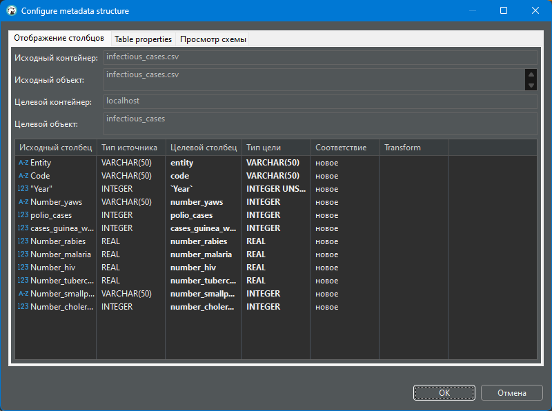
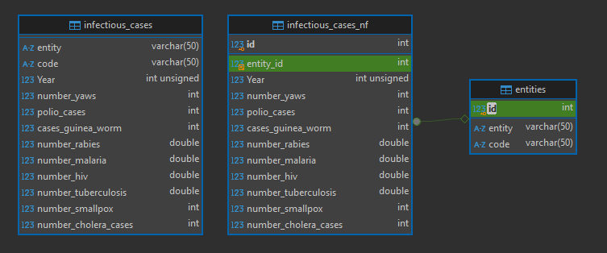
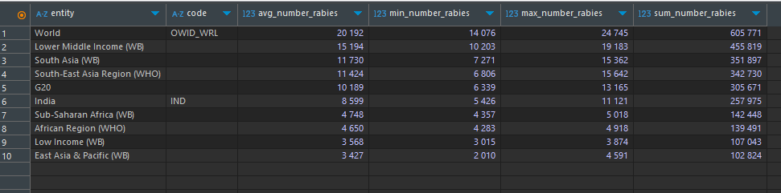
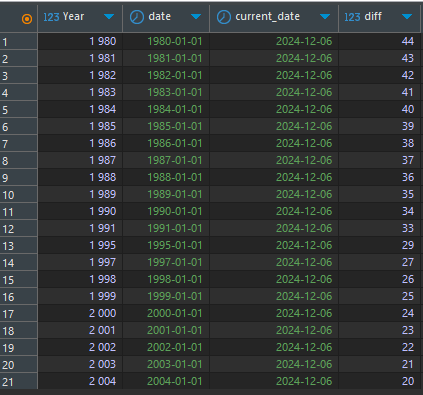
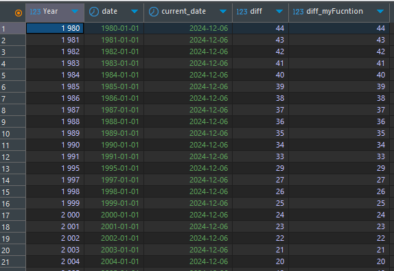

# goit-rdb-fp. Relational Databases: Concepts and Techniques. Фінальний проєкт

## Завдання 1

1. Завантажте дані:

- Створіть схему `pandemic` у базі даних за допомогою SQL-команди.
- Оберіть її як схему за замовчуванням за допомогою SQL-команди.
- Імпортуйте [дані](csv/infectious_cases.csv) за допомогою Import wizard.
- Продивіться дані, щоб бути у контексті.

  💡 Як бачите, атрибути Entity та Code постійно повторюються. Позбудьтеся цього за допомогою нормалізації даних.

---

### Рішення 1

SQL-код: [p1.sql](p1.sql)

Скрин імпорту даних:  

## Завдання 2

2. Нормалізуйте таблицю `infectious_cases` до 3ї нормальної форми. Збережіть у цій же схемі дві таблиці з нормалізованими даними.

---

### Рішення 2

SQL-код: [p2.sql](p2.sql)

Скрин діаграми БД з нормалізованими таблицями:  

## Завдання 3

3. Проаналізуйте дані:

- Для кожної унікальної комбінації `Entity` та `Code` або їх `id` порахуйте середнє, мінімальне, максимальне значення та суму для атрибута `Number_rabies`.

  💡 Врахуйте, що атрибут Number_rabies може містити порожні значення ‘’ — вам попередньо необхідно їх відфільтрувати.

- Результат відсортуйте за порахованим середнім значенням у порядку спадання.
- Оберіть тільки 10 рядків для виведення на екран.

---

### Рішення 3

SQL-код: [p3.sql](p3.sql)

Скрин результату:  

## Завдання 4

4. Побудуйте колонку різниці в роках.

Для оригінальної або нормованої таблиці для колонки `Year` побудуйте з використанням вбудованих SQL-функцій:

- атрибут, що створює дату першого січня відповідного року,

  💡 Наприклад, якщо атрибут містить значення ’1996’, то значення нового атрибута має бути ‘1996-01-01’.

- атрибут, що дорівнює поточній даті,
- атрибут, що дорівнює різниці в роках двох вищезгаданих колонок.

  💡 Перераховувати всі інші атрибути, такі як Number_malaria, не потрібно.

  👉🏼 Для пошуку необхідних вбудованих функцій вам може знадобитися матеріал до теми 7.

---

### Рішення 4

SQL-код: [p4.sql](p4.sql)

Скрин результату:  

## Завдання 5

5. Побудуйте власну функцію.

- Створіть і використайте функцію, що будує такий же атрибут, як і в попередньому завданні: функція має приймати на вхід значення року, а повертати різницю в роках між поточною датою та датою, створеною з атрибута року (1996 рік → ‘1996-01-01’).

---

### Рішення 5

SQL-код функції: [p5_1.sql](p5_1.sql)  
SQL-код перевірки: [p5_2.sql](p5_2.sql)

Скрин результату із використанням створеної функції:  

